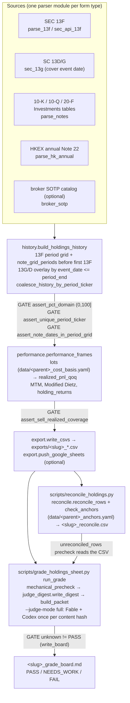

# Holdings pipeline: data flow and gate points

One parent ticker in, a graded and reconciled set of CSVs (plus a Google Sheet)
out. Every box below names the function that does the work; every `GATE` names
the assert or precheck that stops a known bug class from shipping again. The
test that proves each gate is listed in the README's **Gates** table.

## Stage by stage

### 1. Sources

`runner.process_parent_holdings` (live positions) and
`history.build_holdings_history` (QoQ) fan a resolved parent out to its filings.
Each form type has exactly one parser module: `parse_13f` / `sec_api_13f`,
`sec_13g`, `parse_notes`, `parse_hk_annual`. Shared ticker / CUSIP helpers live
in `identity.py`.

`sec_13g` reads the cover "Date of Event Which Requires Filing" (HTML and XML),
falls back to Item 5(c) transaction dates for a 13D, then to the filing date.
That date is stamped as `event_date` on the row and `event_date=YYYY-MM-DD` in
the note (`sec_13g.event_date_for`).

Ownership percentages from any parser go through `identity.assert_pct_domain`
(`(0, 100]`); a row outside that domain is skipped and logged rather than
emitted.

### 2. History grid (`history.build_holdings_history`)

- The period grid is every 13F `period_end` inside the lookback window.
  `--lookback-years N` is calendar years back from today; `0` means no
  calendar cut (`lookback.lookback_start_date` returns `2000-01-01`) and the
  annual-filing ceiling rises to 400.
- `note_grid_periods` adds one period per Investments-table column date that
  precedes the parent's first 13F, so a parent that disclosed investee FV in
  its 10-Q before it ever filed a 13F is not cut at the first 13F.
- For each period, 13F rows win collisions, then `sec_13g.positions_as_of(...,
  by="event")` overlays 13G/D positions and exits whose `event_date` is on or
  before `period_end`, then notes fill `$` (`_merge_period_rows`).
- `coalesce_history_by_period_ticker` + `assert_unique_period_ticker` give one
  row per `period_end × investee_ticker`.
- `assert_note_dates_in_period_grid` runs last: every in-window Investments
  column date with disclosed `$` has to be a `period_end` row, else it raises
  listing the missing dates.

### 3. Performance (`performance.performance_frames`)

- Lots open on buys at period price; `load_disclosed_cost_basis` adds
  filing-stated lots from the gitignored `data/<parent>_cost_basis.yaml`
  (template: `data/cost_basis.example.yaml`).
- `realized_pnl_qoq` has one `cost_method=avg` (primary) and one `fifo`
  (sensitivity) row per sell. `cost_basis_status` is `exact`, `estimated`,
  `mixed`, `partial` or `unknown`; a sale with no lot keeps its row with null
  cost and the reason in `cost_basis_note`.
- `assert_sell_realized_coverage` raises when any sell/exit in history has no
  `avg` realized row.
- `returns_by_period` carries MV, net external flow, MTM and Modified Dietz;
  `holding_returns` is per ticker × period.

### 4. Export (`export.write_csvs`, `export.push_google_sheets`)

Eight CSVs under `exports/` (list in the README) and, unless `--no-sheets`, a
Google Sheet with the same tabs plus the stacked QoQ chart and the Dietz combo
chart. Dagster runs the same code through the `equity_holdings`,
`equity_holdings_history` and `equity_holdings_export` assets.

### 5. Grade (`scripts/grade_holdings_sheet.py`)

`run_grade` always:

1. runs `mechanical_precheck` over the history / portfolio CSVs and writes
   `<slug>_grade_mechanical.json` (`checks` map of precheck id → `pass` /
   `fail` / `unknown` / `n/a` / `not_run`);
2. writes `<slug>_judge_digest.{json,md}` from every row of the five export
   CSVs (coverage grid, every sell with its realized status, per-period Dietz
   and flow, provenance counts, `since_last_digest` diff against the previous
   digest JSON), bounded by aggregation with `truncated: N of M` markers;
3. builds `<slug>_grade_packet.md` (digest always; raw head-slices only with
   `--attach-csv`);
4. writes `<slug>_grade_board.md`.

With `--judge-mode full` it also runs the LLM judges (`--judges fable,codex`)
on the packet, once per export content hash recorded in
`<slug>_last_judged.json`; an unchanged export exits 3 unless `--force`.

`write_board`: any `fail` verdict → FAIL; any `needs_work`, disagreement, or a
`judge:check` still `unknown` → NEEDS_WORK; else PASS.

### 6. Reconcile (`scripts/reconcile_holdings.py`)

Read-only. For each history row with a `$` value or share count it re-fetches
the cited accession from EDGAR (cached under `.cache/reconcile/`) and asserts
the literal sheet string is in the document: `$M` figure for Investments-table
rows, share count + CUSIP for 13F, share count or percent for 13G/D (structured
13D/A prefers `primary_doc.xml` over exhibits). It then checks the gitignored
`data/<parent>_anchors.yaml` (template: `data/anchors.example.yaml`).

Statuses: `anchored`, `not_found`, `fetch_error`, `no_citation`, `skipped_null`,
`anchor_match`, `anchor_mismatch`, `anchor_missing_row`. Exit 1 on any
`not_found` / `anchor_mismatch` / `anchor_missing_row`, 2 when the history CSV
is missing. The grade precheck `unreconciled_rows` reads `<slug>_reconcile.csv`
when present and stays `not_run` otherwise.

## Repo-level gates

- `tests/test_regex_lint.py`: any `[\d,]` quantified regex under
  `hidden_stock/` has to be written `\d[\d,]*`.
- `tests/helpers.py::shaped`: parser tests run on raw HTML and on
  production-flattened text.
- `scripts/check_skill_edit_has_code.py`: a rule line added on an agent-rule
  surface needs a `.py` hunk under `hidden_stock/`, `scripts/` or `tests/` in
  the same commit (pre-commit via `.githooks`, CI over the PR range).
